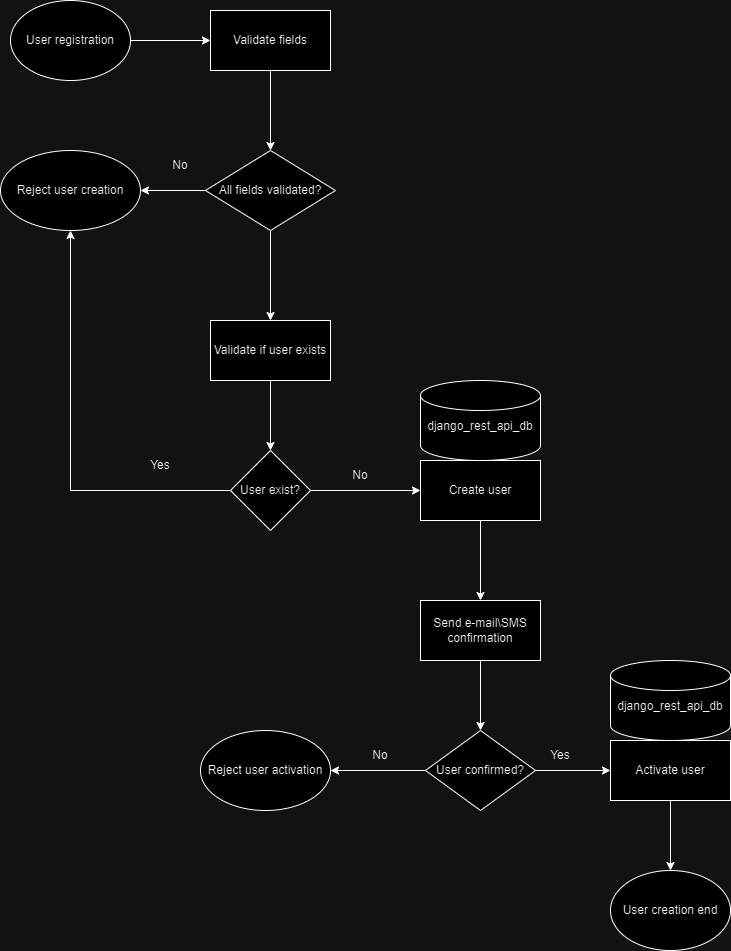
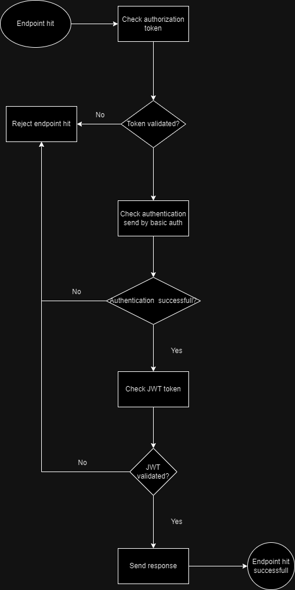

# Django REST API


> REST API made with Django to a big enterprise in the oil and gas sector, to measure and manage sensor's sold by them in real time, with CRUD functions and charts to make it possible to see the average value of it

### Improvements

The project is already finished, but still needs some improvements

- [x] SQLite Database Modeling.
- [x] API with endpoints that receive it in real-time.
- [x] Endpoint to send the data through CSV or XLSX file.
- [x] Screen view to see average value in charts.
- [x] API Documentation and project documentation
- [x] Partial unit tests.
- [x] Integration tests.
- [x] Script to automate the deploy with fly.io.
- [x] Script to execute application with fly.io.
- [x] Authentication structure.
- [x] Diagram to extra solutions.
- [ ] Load test report for the solution in a scenario of 500, 1000, 5000 and 10000 simultaneous requests.
- [ ] Improve unit tests.
- [ ] Improve integration tests.
- [ ] Better UI/UX to homepage dashboard.
- [ ] Another security layer in endpoints.
- [ ] Possibility to send array-types requests.
- [ ] Possibility to send other file types in request.

## 💻 Prerequisites

Before start, please check if you fulfilled all these requisites:

- You've installed [Python](https://www.python.org/).
- You've created the .env file with all the necessary environment variables described in the .env.example file.
- You've read the [API Documentation](https://django-rest-api.fly.dev/api/swagger/).
- You've read the [Project Documentation](https://github.com/pedrohrbarros/django_rest_api/blob/master/README.md).

## 💫 Next developments

### New auth flow:



### New endpoints flow:



## 🚀 Installing django_rest_api

To install django_rest_api follow these steps:

Clone the repository from github:
```
git clone https://github.com/pedrohrbarros/django_rest_api.git
```

Install the necessary requirements:
```
pip install -r requirements.txt
```

## ☕ Using django_rest_api

To use django_rest_api project:

Create all migrations to SQLite database or the database that you want (you have to configure it inside django_rest_api/settings.py):
```
python3 manage.py makemigrations
```

Apply all migrations:
```
python3 manage.py migrate
```

Collect all static files:
```
python3 manage.py collectstatic --noinput
```


Check project to see failures in the system:
```
python3 manage.py check
```

Test the endpoints:
```
python3 manage.py test
```

Run the project:
```
python3 manage.py runserver
```

## 📫 Contributing to django_rest_api

To contribute to django_rest_api project

1. Fork this repo.
2. Create a new branch: `git checkout -b <branch_name>`.
3. Make your commits and send them: `git commit -m '<commit_message>'`.
4. Send it to the original branch: `git push origin <django_rest_api> / <local>`.
5. Create your pull request.

As alternative check the Github documentation [How to create a pull request](https://help.github.com/en/github/collaborating-with-issues-and-pull-requests/creating-a-pull-request).

## 📝 License

This project has a free license.

README template made by: [IuriCode](https://github.com/iuricode/)